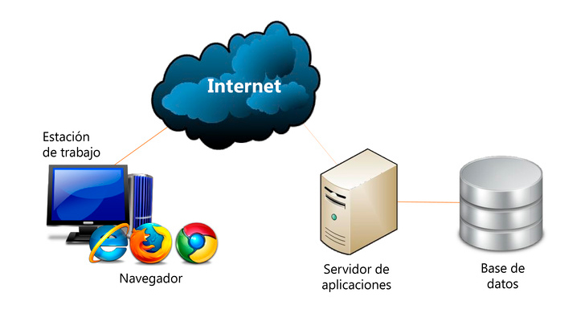

[`Programación con JavaScript`](../../Readme.md) > [`Sesión 01`](../Readme.md) > `Reto Final`

---

## Reto Final

### Objetivo

Definir el proyecto que se desarrollará a lo largo del módulo.

#### Desarrollo

Una aplicación web es una herramienta informática accesible desde cualquier navegador, bien sea a través de internet o por medio de una red local. Las aplicaciones de este presentan grandes ventajas:

- La primera y quizás la más importante es que el usuario no necesita realizar ningún tipo de instalación o descarga, el acceso a la aplicación y toda su funcionalidad se da por medio del navegador.
- Una aplicación web es multiplataforma y multidispositivo. Esto significa que nos podemos olvidar del sistema operativo de cada dispositivo desde el cuál se está accediendo y los usuarios puedes entrar desde un ordenador, tablet o smartphone.
- Otra gran ventaja es que la potencia no está en el dispositivo que accede, por lo que aunque tengamos un ordenador con bajos recursos la aplicación puede ser muy potente, ya que el peso no lo soporta el equipo desde el que se accede sino el servidor donde está alojada.
- La aplicación puede estar en la nube, con lo que sería accesible para cualquier ordenador con acceso a internet (aunque también podría ser una aplicación local en una intranet).
- Y para finalizar, es muy adaptable, visualmente intuitiva y muy fácil de actualizar si fuera necesario.

Años atrás muchas de estas necesidades sólo podían ser cubiertas por aplicaciones de escritorio que requerían ser instaladas en el equipo del usuario. Hoy en día las aplicaciones web crecen en popularidad por muchas razones incluyendo las ventajas descritas anteriormente.

Existen tres partes fundamentales en una aplicación web:

- La base de datos que es donde se almacena toda necesaria como contenidos, usuarios, permisos, etc.
- La aplicación en sí que es alojada en un servidor. Puede estar en la nube o un servidor local.
- El usuario quien accede con cualquier dispositivo mediante un navegador y conexión a internet.

Este último punto se conoce como Front End. Es toda la parte visual e interactiva en contacto con el usuario final. Hay muchas librerías y frameworks de JavaScript como Angular, React o Vue.js que permiten crear aplicaciones robustas. Sin embargo, no es necesario hacer uso de estas herramientas para construir el Front End de una aplicación web.

De hecho, a lo largo de este módulo aprenderás varios conceptos de JavaScript como variables, controles de flujo, funciones, objetos, arreglos, distintos paradigmas de programación y cómo manipular el DOM. Todo esto en conjunto te permitirá desarrollar una aplicación web.

Ahora que tienes una idea más clara de los temas que serán abordados en este módulo es momento de empezar a planear tu proyecto personal. Si necesitas un poco de inspiración puedes revisar esta <a href="https://learnvanillajs.com/projects/" target="\_blank">lista de ideas</a>.  

Todos los proyectos que se mencionan en este recurso pueden ser desarrollados sin el uso de librerías o frameworks. Toma en cuenta que tienen distintos niveles de dificultad, algunos son considerablemente sencillos, por lo que puedes combinar distintas ideas para crear un proyecto más robusto. Algunos otros requieren de conocimientos previos en temas que no son abordados en este módulo, pero no significa que no los puedas realizar. Puedes desarrollar una parte y revisar con tu experto alternativas para la parte faltante, o bien, te puede proporcionar recursos que te ayuden a terminar el proyecto completo.
