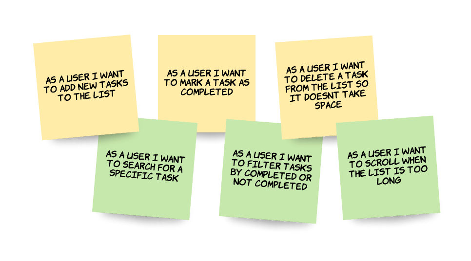

[`Programación con JavaScript`](../Readme.md) > [`Sesión 02`](../Readme.md) > `Postwork`

---

## Postwork

### Objetivo

Realizar los mockups y la planeación del proyecto que se desarrollará a lo largo del módulo. También, reforzar conceptos utilizados en la sesión.  

#### Desarrollo   

Lo siguiente que puedes hacer es crear user stories. Los user stories son descripciones pequeñas y simples de una funcionalidad o feature desde el punto de vista de la persona que va a hacer uso de dicho feature.  Normalmente esa persona es el usuario final, pero también puede ser alguien con rol de administrador o permisos especiales.   

Se pueden escribir de la siguiente manera:

```
Como <tipo de usuario>, quiero <algún objetivo> para <algún motivo o razón>
```

Algunos ejemplos para el Todo App podrían ser:

- Como usuario quiero agregar nuevas tareas a la lista.  
- Como usuario quiero marcar una tarea como completada.  
- Como usuario quiero eliminar una tarea para que no utilice espacio.  
- Como usuario quiero filtrar tareas completadas o no completadas.  
- Como usuario quiero buscar una tarea específica.  
- Como usuario quiero scrollear cuando la lista es muy larga.  



Con esto tenemos una lista de features que queremos en nuestra aplicación. Ahora podemos decidir cuáles son obligatorias tener en nuestra aplicación y cuáles podemos dejar para después e incluir como mejoras de la aplicación.  


#### Opcional

Para reforzar lo visto en clase se recomienda leer el [capítulo 2](https://eloquentjavascript.net/02_program_structure.html) del siguiente libro interactivo:

**[Eloquent JavaScript](https://eloquentjavascript.net/)**

En este capítulo encontrarás más información sobre el control de flujo de una aplicación mediante el uso de condicionales y blucles, también vienen convenciones comunes para nombrar variables y al final del capítulo verás 3 ejercicios que puedes resolver desde la página.
