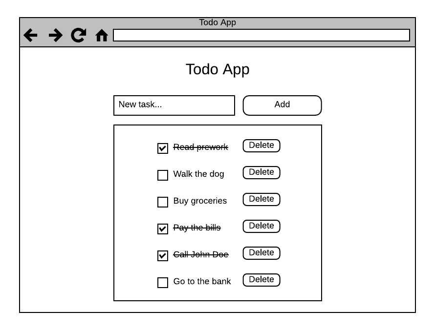

[`Programación con JavaScript`](../../Readme.md) > [`Sesión 02`](../Readme.md) > `Reto Final`

---

## Reto Final

### Objetivo

Realizar los mockups y la planeación del proyecto que se desarrollará a lo largo del módulo. También, reforzar conceptos utilizados en la sesión.  

#### Desarrollo

Ahora que ya tienes definido cuál será tu proyecto debes comenzar la planeación. Tal vez consideres esta parte como un paso innecesario pero es bueno que te acostumbres a siempre hacerlo independientemente del tipo de proyectos que tengas, de esta forma te ahorrarás tiempo de desarrollo.

Lo primero es hacer un mockup de la aplicación. Un mockup es un diseño digital de un sitio web y/o aplicación. Estos se utilizan en la fase de diseño inicial para visualizar ideas y conceptos en el contexto del diseño web e incluyen la estructura de navegación, el sitio y los elementos de diseño en detalle.

Los mockups se utilizan para pruebas de usabilidad mucho antes de si quiera empezar a programar. De este modo, cualquier problema se detecta antes de crear el prototipo y se reduce el riesgo de que un concepto tenga que ser completamente revisado a mitad de la fase de desarrollo. Como se mencionó anteriormente, los mockups pueden contribuir a ahorrar tiempo y dinero en un proyecto.

No es necesario utilizar algún software, este bosquejo se puede realizar con papel y lápiz, y puede ser tan detallado o minimalista como gustes. El objetivo es plasmar en físico las ideas que tienes sobre cómo debe verse y qué quieres que haga.

Incluso puedes crear varios mockups para simular la interación del usuario con la aplicación, es decir, puedes crear distintas vistas de la aplicación que se muestran cuando un usuario hace click en algún botón en específico o cuando llena un formulario.
