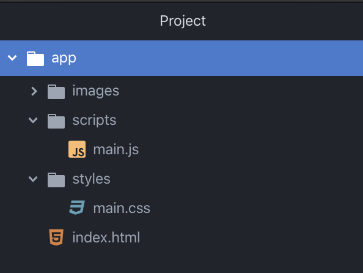
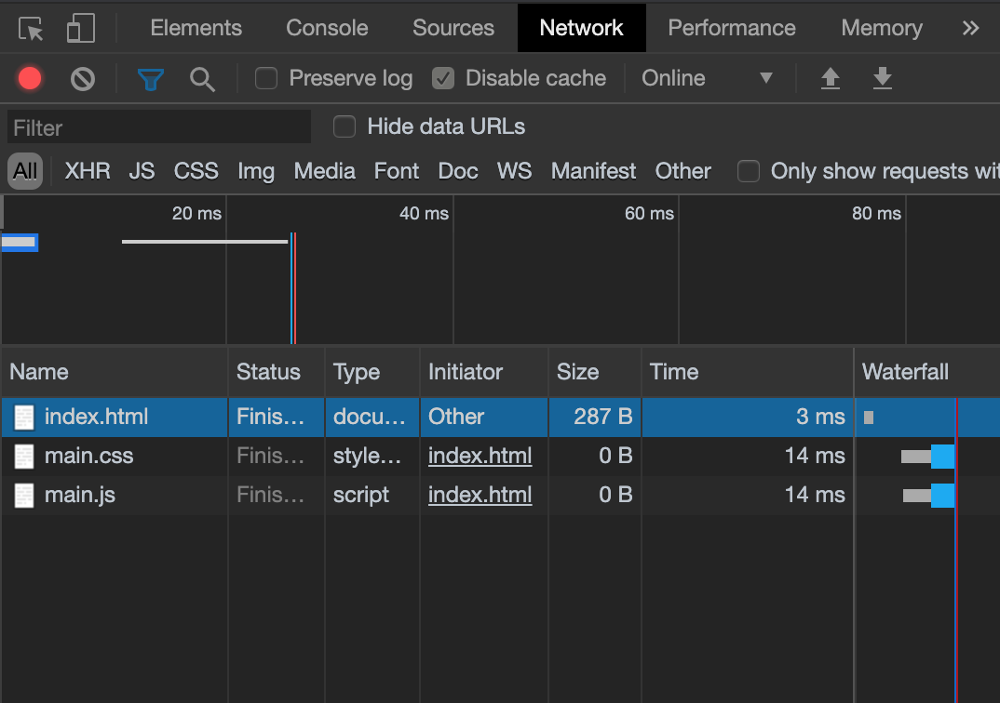

[`Programación con JavaScript`](../../Readme.md) > [`Sesión 03`](../Readme.md) > `Reto Final`

---

## Reto Final

### Objetivo

Crear la estructura de archivos y carpetas para el proyectos.

#### Desarrollo

Hasta el momento contamos con la idea del proyecto, unos mockups para visualizar gráficamente cómo será la interfaz y varios user stories para determinar la funcionalidad de distintas partes del proyecto. Lo único que hace falta para poder empezar a meternos en el código es establecer la estructura de carperas y archivos.

```
app/
|-- images/
|
|-- scripts/
|   |-- main.js
|
|-- styles/
|   |-- main.css
|
|-- index.html
```

Es una buena práctica organizar de alguna manera todos los archivos de cualquier proyectos en lugar de tenerlos todos juntos en la misma carpeta. Hay muchas opiniones entre cómo se debería llevar la estrcutura, hay quienes organizan todo por tipo de archivo, hay quienes lo hacen por funcionalidad e incluso hay quienes crean su propia convención.

Lo importante es sea fácil encontrar cada cosa. La estructura que decidas puede cambiar con el tiempo si así lo consideras. Por el momento trabajemos con el orden sugerido más arriba.

La carpeta con el nombre del proyecto es la carpeta principal, en este caso `app`. Dentro tenemos tres carpetas, una para todas las imágenes que necesites, otra para los estilos y finalmente una para el código de JavaScript.



Por el momento podemos dejar `main.css` y `main.js` en blanco. Vamos a crear la estrcutura de `index.html` e incluir estos archivos.

```html
<!DOCTYPE html>
<html lang="es">
  <head>
    <meta charset="utf-8">
    <link rel="stylesheet" href="./styles/main.css" />
    <title>App Title</title>
  </head>
  <body>

    <h1>Hello World!</h1>

    <script type="text/javascript" src="./scripts/main.js"></script>
  </body>
</html>
```

Es importante tener cuidado con las rutas. Usar `./` significa que debe buscar a partir del lugar donde se encuentra el archivo, si omites el punto tratará de buscar desde la raíz del sistema, no del proyecto. Para confirmar que los archivos fueron cargados correctamente puedes abrir `index.html` en Google Chrome, abrir la consola y cambiar a la pestaña `Network`.



Si alguno de los archivos aparece en rojo es que no pudo ser cargado por el navegador y seguramente se debe a que la ruta no es correcta. Una vez que todos los nombres aparezcan en blanco estarás listo para comenzar.
