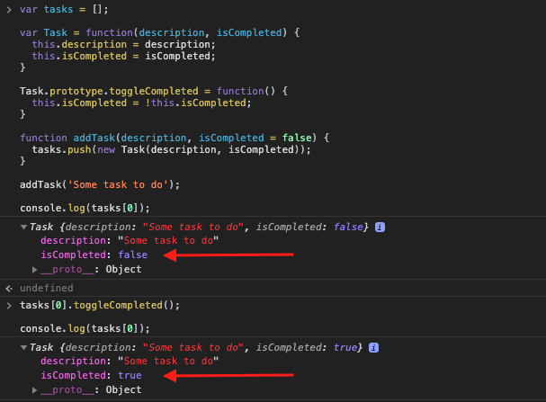

[`Programación con JavaScript`](../../Readme.md) > [`Sesión 05`](../Readme.md) > `Postwork`

---

## Postwork

### Objetivo

Integrar function constructors e instanciamiento de objetos en el proyecto.

#### Desarrollo

Una ventaja más de crear un function constructor para `Task` es que nos permite agregar funciones en el prototype para que sean heredadas a todas las instancias. Un caso muy práctico sería para funciones que deban modificar propiedades del mismo objeto.

```javascript
function toggleTaskCompleted(index) {
	tasks[index].isCompleted = !tasks[index].isCompleted;
}
```

La sesión anterior creamos la función `toggleTaskCompleted` para modificar la propiedad `isCompleted` de cualquier tarea en base a su posición en el arreglo. Podemos poner esta función en el prototype de `Task` de la siguiente manera:

```javascript
var Task = function(description, isCompleted) {
  this.description = description;
  this.isCompleted = isCompleted;
}

Task.prototype.toggleCompleted = function() {
  this.isCompleted = !this.isCompleted;
}
```

Ahora todos los objetos creados a partir de `Task` tendrán acceso a esta función.

```javascript
var tasks = [];

function addTask(description, isCompleted = false) {
  tasks.push(new Task(description, isCompleted));
}

addTask('Some task to do');

console.log(tasks[0]);  // { description: 'Some...', isCompleted: false }

tasks[0].toggleCompleted();

console.log(tasks[0]);  // { description: 'Some...', isCompleted: true }
```


