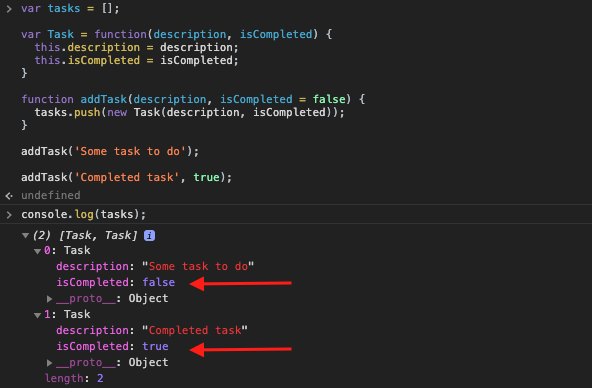

[`Programación con JavaScript`](../../Readme.md) > [`Sesión 05`](../Readme.md) > `Reto Final`

---

## Reto Final

### Objetivo

Integrar function constructors e instanciamiento de objetos en el proyecto.

#### Desarrollo

Ya vimos cómo podemos instanciar múltiples objetos a partir de un constructor para evitar repetir el mismo código una y otra vez, ahora podemos implementar la misma lógica en el proyecto.

Siguiendo el ejemplo de la aplicación para crear tareas, pasamos de tener múltiples variables como las siguientes:

```javascript
var task1 = {
  description: 'Some task to do',
  isCompleted: false
}

var task2 = {
  description: 'Another task to do',
  isCompleted: false
}

var task3 = {
  description: 'One more task to do',
  isCompleted: false
}
```

A guardar todos los objetos dentro de un arreglo:

```javascript
var tasks = [
  {
    description: 'Some task to do',
    isCompleted: false
  },
  {
    description: 'Another task to do',
    isCompleted: false
  },
  {
    description: 'One more task to do',
    isCompleted: false
  }
]
```

Para implementar los conceptos de programación orientada a objetos vistos hasta ahora, vamos crear un function constructor `Task` e instanciar los tasks que irán dentro del arreglo `tasks`.

```javascript
var Task = function(description, isCompleted) {
  this.description = description;
  this.isCompleted = isCompleted;
}
```

Con esto podemos instanciar nuevos objetos a partir de `Task`. Para ello vamos a crear una función que se encargará de agregar una nueva tarea al arreglo que inicialmente se encontrará vacío.

```javascript
var tasks = [];

function addTask(description, isCompleted = false) {
  tasks.push(new Task(description, isCompleted));
}
```

En JavaScript podemos asignar un valor por default a los parámetros de una función. Esto significa que si no pasamos un valor para `isCompleted` la función le asignará `false` por default, por lo que sólo debemos pasarle `description` a la función al menos que queramos crear una tarea ya completada.

```javascript
addTask('Some task to do');

console.log(tasks[0]);  // { description: 'Some...', isCompleted: false }

addTask('Completed task', true);

console.log(tasks[1]);  // { description: 'Completed...', isCompleted: true }
```


