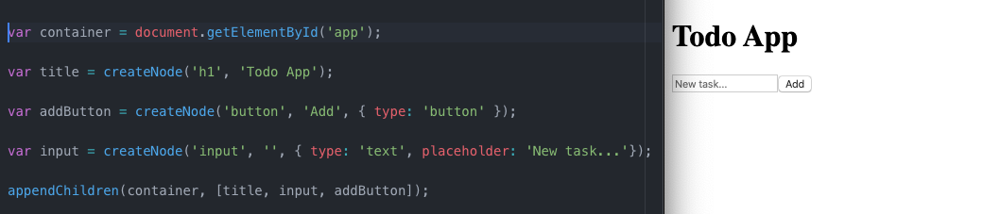
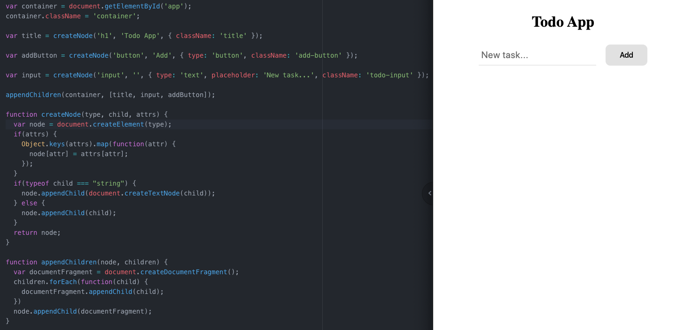

[`Programación con JavaScript`](../../Readme.md) > [`Sesión 07`](../Readme.md) > `Postwork`

---

## Postwork

### Objetivo

Crear nodos para dar estructura al proyecto en base a los mockups realizados anteriormente.

#### Desarrollo

Ya hemos visto cómo cambiar la estructura de un documento manipulando el DOM al crear elementos y modificarlos. Además, en el [Reto Final](../Reto-final) realizamos dos funciones auxiliares que facilitan la creación de nodos.

Ahora puedes comenzar a integrar todo lo visto en tu proyecto. En la [sesión 3](../../Sesion-03/Reto-final) vimos una estructura sugerida para iniciar el proyecto, en el HTML puedes tener un sólo `<div>` e ir construyendo los demás elementos desde JavaScript.

```html
<!DOCTYPE html>
<html lang="es">
  <head>
    <meta charset="utf-8">
    <link rel="stylesheet" href="./styles/main.css" />
    <title>Todo App</title>
  </head>
  <body>

    <div id="app"></div>

    <script type="text/javascript" src="./scripts/main.js"></script>
  </body>
</html>
```

Este elemento `<div>` lo usaremos como un contenedor para el resto de la aplicación.

```javascript
var container = document.getElementById('app');
```

Todos los demás elementos que creemos los agregaremos como hijos de `container`.

```javascript
var title = createNode('h1', 'Todo App');

var addButton = createNode('button', 'Add', { type: 'button' });

var input = createNode('input', '', { type: 'text', placeholder: 'New task...' });
```

Sin usar la función `createNode` que hicimos anteriormente tendríamos que crear los nodos de texto por separado y agregar los atributos mediante las propiedades `.type` y `.placeholder` respectivamente. El segundo argumento para el input es un string vacío ya que la etiqueta `<input>` se cierra sola y no tiene nodos hijos.

En lugar de usar `.appendChild()` tres veces podemos agregar estos elementos con la función auxiliar `appendChildren()`.

```javascript
appendChildren(container, [title, input, addButton]);
```



Como podrás ver, puedes realizar toda la estructura del mockup de tu proyecto sólo con JavaScript. Al final tendrás que agregar estilos, recuerda que `class` es una palabra reservada en JavaScript por lo que debes usar la propiedad `className`.

```javascript
var container = document.getElementById('app');
container.className = 'container';

var title = createNode('h1', 'Todo App', { className: 'title' });

var addButton = createNode('button', 'Add', { type: 'button', className: 'add-button' });

var input = createNode('input', '', { type: 'text', placeholder: 'New task...', className: 'todo-input' });
```


