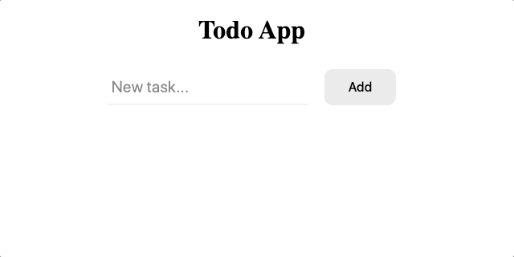

[`Programación con JavaScript`](../../Readme.md) > [`Sesión 08`](../Readme.md) > `Reto Final`

---

## Reto Final

### Objetivo

Integrar event handlers para agregar interactividad en el proyecto.

#### Desarrollo

Como reto final debes permitir al usuario interactuar con tu aplicación agregando los event handlers necesarios.

Retomando el ejemplo del Todo App, parte crucial de la aplicación es poder agregar tareas. Ya habíamos creado anteriormente la función `addTask` para esto.

```javascript
function addTask(tasks, description, isCompleted = false) {
  var newTasks = [].concat(tasks);

  newTasks.push({
    description: description,
    isCompleted: isCompleted
  });

  return newTasks;
}
```

La solución más obvia sería agregar un event handler al botón para que llame a la función `addTask`. Sin embargo, es necesario hacer unos pasos extras antes de agregar la nueva tarea a nuestra lista como validar que el input no se encuentra vacío, e incluso después de agregar la tarea tenemos que hacer algunos pasos como limpiar el input y finalmente mostrar la lista. Para todo esto necesitamos una funcción intermediaria.

```javascript
var addButton = createNode('button', 'Add', { type: 'button', className: 'add-button' });
addButton.addEventListener('click', handleClick);

function handleClick() {
  if(input.value !== '') { // Check input isn't empty
    tasks = addTask(tasks, input.value); // Add the task
    input.value = ''; // Clean input
    renderList(listContainer, tasks); // Render the list
  }
}
```

Ahora que se actualizó `tasks` podemos llamar la función `renderList` para crear los nodos que representant las tareas y agregarlos a `listContainer`.

```javascript
function renderList(node, tasks) {
  node.innerHTML = ''; // Remove all items first

  var fragment = document.createDocumentFragment();

  tasks.forEach(function(task) {
    var listItem = createNode('div', task.description, { className: 'list-item' });
    fragment.appendChild(listItem);
  })

  node.appendChild(fragment);
}
```

Cuando trabajamos con funciones que tengan que agregar nodos a una lista en ocasiones es necesario limpiar esa lista primero, de lo contrario cada nuevo nodo se suma a la lista anterior generando duplicados. Con `node.innerHTML = ''` eliminamos todo el contenido del nodo que contiene la lista.

Otra ventaja de haber separado `renderList` del handler es que podemos podemos llamar esta función desde otras partes de la aplicación si es necesario modificar la lista, por ejemplo, agregando un botón para borrar todas las tareas.



Ahora puedes agregar los event handlers necesarios a tu proyecto separando la lógica que manipula datos de las funciones que crean nodos y manipulan el DOM.
